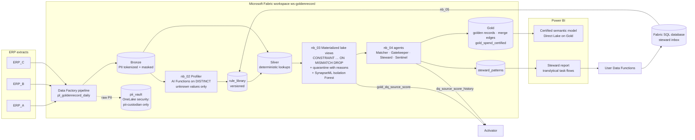

# 02 · Architecture

Everything in the solution runs in Microsoft Fabric. Native Fabric features detect and score; GoldenRecord
adds the remediation and resolution layer on top ([00-positioning.md](00-positioning.md)).

## Flow



## Which Fabric service does what

| Step | Fabric service | Item |
|---|---|---|
| Land and orchestrate | Data Factory | `pl_goldenrecord_daily`: Copy → nb_05 → nb_01 → nb_02 → nb_03 → nb_04 |
| Store | OneLake, Lakehouse | `lh_goldenrecord`: Bronze, Silver, Gold Delta tables |
| Protect | OneLake security, Azure Key Vault | Tokenize and mask at ingestion; `pii_vault` role-restricted ([sql/onelake_security.md](../fabric/sql/onelake_security.md)) |
| Learn mappings and rules | Notebooks + **AI Functions** | `nb_02`: one call per batch of distinct unknown values, cached |
| Detect | **Materialized lake views** | `nb_03`: constraints generated from `config/dq_rules.yaml` + enforced library rules |
| Score anomalies | Fabric Data Science (SynapseML) | Isolation Forest score per invoice; the deterministic A01 rule gates |
| Resolve and remediate | Notebooks + AI Functions | `nb_04`: matching, guardrail, survivorship, pattern triage |
| Steward actions | Power BI **translytical task flows**, **User Data Functions**, Fabric SQL database | `udf_goldenrecord_steward`; `nb_05` applies the inbox to the library |
| Alert | **Activator** | Per-source score drop, suspect merges, anomaly spikes |
| Report | Power BI, Direct Lake | Certified model on `gold_spend_certified` only |
| Learn from stewards | Fabric Data Science, MLflow | `nb_06`: match classifier, registered model |
| Govern (optional) | Purview | Labels, lineage, DQ scorecard where the tenant has it |

Nothing in the solution runs outside Fabric. The Docker stack in this repository is an **offline dev
harness** ([08-dev-harness.md](08-dev-harness.md)): it uses open-source stand-ins so the team can build and
test without a capacity. The business logic is the same Python package in both places
([ADR 0001](adr/0001-fabric-native-with-local-core.md)).

## AI cost model

| Where | When the LLM is called | Steady state |
|---|---|---|
| Mapping authoring (nb_02) | Once per distinct unknown value, in batches of 40; answers cached | 0 calls when no new values arrive |
| Grey-zone pairs (nb_04) | Only pairs with a deterministic score of 0.50–0.90 that no library match rule covers and the cache has not seen | Falls as stewards approve match patterns |
| Rule authoring | When a steward types a rule | On demand |
| Alerts | One explanation per fired alert | Rare |

On the seeded dataset, "LLM on every row" would be 107,525 calls per run. GoldenRecord makes 0 on a rerun
([ADR 0006](adr/0006-llm-authors-patterns-once.md)).

## Tables

| Layer | Tables |
|---|---|
| Bronze | `bronze_<erp>_vendors` (masked + `pii_*_token`), `bronze_<erp>_invoices`, `pii_vault` (restricted) |
| Silver | `silver_vendor`, `silver_invoice` (with `fixed_by`), `silver_invoice_anomaly`, `silver_dq_failures`, `silver_match_pairs`; MLVs `silver_invoice_valid`, `silver_invoice_quarantine`, `silver_vendor_dq` |
| Gold | `gold_vendor`, `gold_vendor_xref` (+ history), `gold_merge_edges`, `gold_cluster_alerts`; MLVs `gold_spend_certified`, `gold_dq_source_score` |
| Control | `rule_library`, `steward_patterns`, `pattern_decisions`, `llm_mapping_cache`, `llm_pair_cache`, `dq_scorecard`, `dq_run_metrics`, `dq_source_score_history`, `agent_events`, `run_history` |

## Code structure

```
src/goldenrecord/
  privacy.py        tokenize and mask PII at ingestion
  mappings.py       learned value mappings (city, name token, currency)
  library.py        versioned rule library
  patterns.py       root-cause pattern triage
  fixes.py          apply approved record fixes with lineage
  fabric_sql.py     generate MLV constraint SQL from the rule catalog
  fabric_runtime.py FabricLakehouse + FabricAIFunctionsLLM adapters
  agents/           profiler, quality, matcher, gatekeeper, steward, sentinel, orchestrator
  standardize.py, rules.py, matching.py, survivorship.py, evaluate.py, ablation.py
fabric/notebooks/   nb_01 … nb_06    fabric/functions/   User Data Functions    fabric/sql/   SQL DB + security
```
