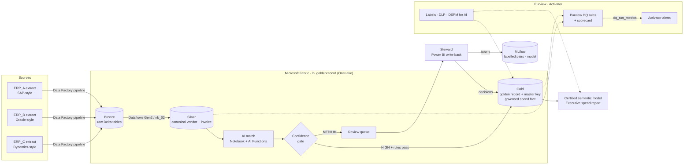

# 02 · Architecture

## Logical flow



## Layers

| Layer | Tables | Rule |
|---|---|---|
| Bronze | `bronze_<erp>_vendors`, `bronze_<erp>_invoices` | Exact copy of each extract, all strings, plus `_source_system`, `_source_file`, `_ingested_at` |
| Silver | `silver_vendor`, `silver_invoice`, `silver_dq_failures`, `silver_match_pairs` | One canonical schema; standardized formats; nothing dropped, every failure recorded |
| Gold | `gold_vendor`, `gold_vendor_xref`, `gold_spend_fact`, `review_queue`, `quarantine_invoice` | Only rule-passing, matched data; stable `master_key` |
| Ops | `dq_scorecard`, `dq_run_metrics`, `steward_decisions` | Evidence, alerts and labels |

Schemas are in [04-data-model.md](04-data-model.md).

## Runtime sequence (pipeline `pl_goldenrecord_daily`)

1. Copy activities land the three extracts in `Files/landing/`.
2. `nb_01` writes Bronze.
3. `nb_02` standardizes to Silver, runs rules, appends `dq_run_metrics` (Activator watches it).
4. Purview DQ scan runs on the Silver tables (scheduled).
5. `nb_03` scores candidate pairs; AI Functions review the grey zone.
6. `nb_04` merges steward decisions, builds golden records, writes Gold.
7. Direct Lake semantic model refreshes automatically; the report reads Gold only.
8. `nb_05` retrains the matcher weekly (or on demand) from `steward_decisions`.

## Code structure

```
goldenrecord/
├── src/goldenrecord/     # tested business logic, packaged as a wheel for the Fabric Environment
│   ├── synth.py          # synthetic multi-ERP data + ground truth
│   ├── standardize.py    # Bronze → Silver mapping and cleaning
│   ├── rules.py          # DQ rules engine + anomaly check
│   ├── matching.py       # blocking, scoring, bands, clustering
│   ├── survivorship.py   # golden record + stable master key
│   ├── evaluate.py       # metrics against ground truth
│   └── pipeline.py       # local end-to-end run mirroring the notebooks
├── fabric/notebooks/     # thin Fabric wrappers (nb_01 … nb_05)
├── config/dq_rules.yaml  # rule catalog, mirrored in Purview
├── purview/ activator/ powerbi/   # configuration guides for each Fabric/Purview item
├── docs/                 # this documentation
└── tests/
```
